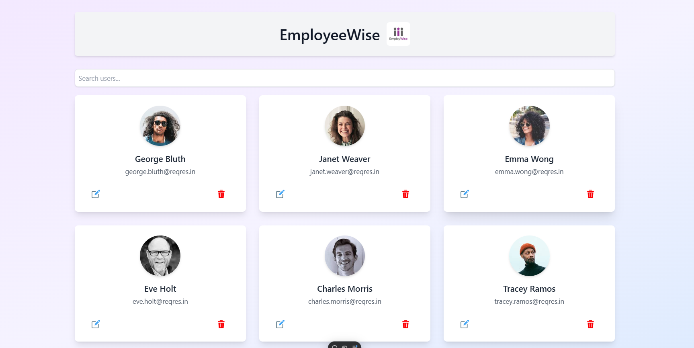

# EmployWise Assignment

## Overview
This project is a React application that integrates with the Reqres API to manage users. It includes functionalities such as authentication, user listing, editing, and deleting users. The assignment is structured into three levels of increasing complexity.

## ScreenShots



### Features

#### Level 1: Authentication Screen
- Basic authentication using POST `/api/login`
- Credentials:
  - **Email**: eve.holt@reqres.in
  - **Password**: cityslicka
- On successful login, the token is stored, and the user is redirected to the Users List page

#### Level 2: List All Users
- Displays a paginated list of users fetched from GET `/api/users?page=1`
- Users' details (first name, last name, avatar) are shown in a structured layout
- Supports pagination or lazy loading

#### Level 3: Edit, Delete, and Update Users
- **Edit:**
  - Opens a form pre-filled with the user's data
  - Updates user details via PUT `/api/users/{id}`
- **Delete:**
  - Deletes the user via DELETE `/api/users/{id}`
  - Displays success or error messages based on the operation

### Rules and Guidelines Followed

1. **Framework & Libraries:**
   - Used React as the frontend framework
   - Axios for HTTP requests
   - Tailwind CSS for styling

2. **User Interface:**
   - Responsive and user-friendly design
   - Mobile and desktop compatible

3. **Error Handling:**
   - Comprehensive error messages for API failures
   - Form validation for login and edit screens

4. **Persistence:**
   - Login token stored in local storage
   - Secure redirect mechanism for authentication

5. **Code Quality:**
   - Modular and clean code structure
   - Efficient use of React hooks
   - Follows best practices in React development

6. **Bonus Features:**
   - Client-side search and filtering
   - React Router for seamless navigation
   - Deployed on a hosting platform

## Technology Stack
- React
- Tailwind CSS
- React Router
- Axios
- React Toastify

## Installation Guide

1. **Clone the repository:**
   ```bash
   git clone https://github.com/your-username/employwise-assignment.git